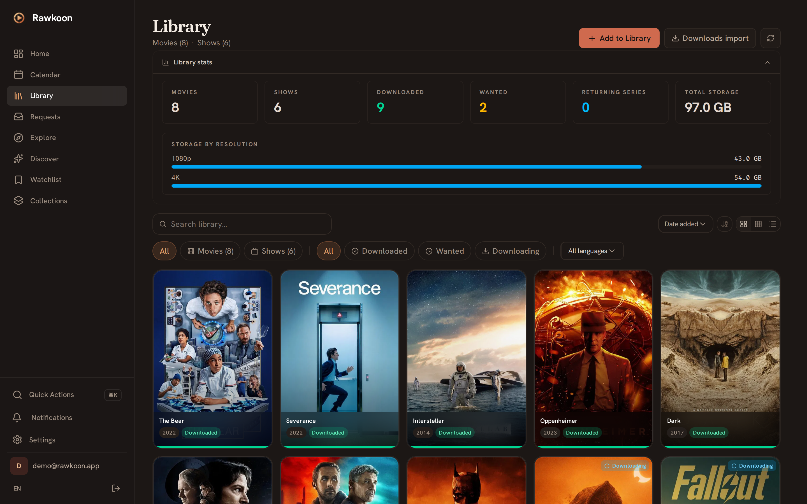

<p align="center">
  
</p>

<h1 align="center">Rawkoon</h1>

<p align="center">
  <a href="LICENSE"></a>
  <a href="https://github.com/samuelloranger/rawkoon/releases"></a>
  <a href="https://github.com/samuelloranger/rawkoon/actions/workflows/ci.yml"></a>
  <a href="https://github.com/samuelloranger/rawkoon/pkgs/container/rawkoon"></a>
</p>



A self-hosted movie and TV library with a built-in download manager — one app instead of the Radarr/Sonarr/Overseerr stack. Discover titles through TMDB, search releases, grab them with qBittorrent, and track your library from a single web UI.

Already running \*arr? **Settings → Library import** migrates your existing Radarr and/or Sonarr library (metadata, files, MediaInfo) so you can switch without starting over.

> **Early-stage project.** Breaking changes may occur between releases.

## Features

**Media library & downloads**

- **Media library** — native Radarr/Sonarr replacement: TMDB discovery, release search, quality profiles, and grab workflows for movies and TV
- **\*arr migration** — one-time import from Radarr and/or Sonarr to ease switching
- **Explore** — browse and discover movies and TV via TMDB, add straight to your library
- **Watchlist** — track what you want to watch with one-click add
- **Quality profiles & custom formats** — define preferred quality, then score and pick releases automatically
- **Torrents** — qBittorrent management with real-time activity streaming (SSE)

**Media tracking**

- **Collections** — manage and complete your media collections
- **Calendar** — upcoming movie / TV / episode release schedule
- **Jellyfin/Plex** — latest additions, now-watching, and inbound webhook notifications

**Platform**

- **Dashboard** — download activity, latest additions, upcoming releases at a glance
- **Notifications** — in-app + Web Push (VAPID)
- **Integrations** — configurable connections to external media services
- i18n (i18next), PWA-ready with service worker, activity log across features

## Quick start

The production image runs the API and the pre-built frontend from a single container, backed by PostgreSQL and Redis. Copy [`docker-compose.prod-example.yml`](docker-compose.prod-example.yml) and start it:

```bash
# 1. Copy the example compose file
cp docker-compose.prod-example.yml docker-compose.prod.yml

# 2. Create your .env from the example
cp .env.example .env
# At minimum set SECRET_KEY, BETTER_AUTH_SECRET, ALLOWED_EMAILS, ADMIN_EMAILS, DATABASE_URL

# 3. Start everything
docker compose -f docker-compose.prod.yml up -d

# 4. Run database migrations
docker compose -f docker-compose.prod.yml exec rawkoon bunx prisma migrate deploy
```

```yaml
services:
  rawkoon:
    image: ghcr.io/samuelloranger/rawkoon:latest
    env_file: [.env]
    volumes:
      - ./data:/app/data
      - ./vapid_keys:/app/vapid_keys
    ports:
      - "3000:3000"
    restart: unless-stopped
  # + postgres:15 and redis:7 — see docker-compose.prod-example.yml
```

The app is available on port `3000` by default. Sign-up is restricted to the emails listed in `ALLOWED_EMAILS`.

## Configuration

Copy `.env.example` to `.env`. Required variables:

| Variable             | Description                                                              |
| -------------------- | ------------------------------------------------------------------------ |
| `SECRET_KEY`         | Encryption key for stored secrets — change from default                  |
| `BETTER_AUTH_SECRET` | Session signing secret — min 32 random chars (`openssl rand -base64 32`) |
| `DATABASE_URL`       | PostgreSQL connection string                                             |
| `ALLOWED_EMAILS`     | Comma-separated list of emails allowed to register                       |
| `ADMIN_EMAILS`       | Comma-separated list of admin emails                                     |
| `BASE_URL`           | Public URL of the app (e.g. `https://rawkoon.example.com`)               |

Optional integrations:

| Variable                                 | Description                  |
| ---------------------------------------- | ---------------------------- |
| `TMDB_API_KEY`                           | Required for media discovery |
| `VAPID_PUBLIC_KEY` / `VAPID_PRIVATE_KEY` | Web push notifications       |
| `SMTP_*`                                 | Email delivery               |

See `.env.example` for the full reference.

### General settings (admin UI)

Admins can configure global app behavior via **Settings → General**:

| Setting                      | Default            | Options                    | Purpose                                   |
| ---------------------------- | ------------------ | -------------------------- | ----------------------------------------- |
| **Country/Region**           | US                 | Any supported country      | Sets the TMDB release-date region         |
| **Upcoming releases window** | 1 year (12 months) | 3, 6, 12, or 24 months     | How far ahead to show upcoming movies/TV  |
| **Languages**                | English, French    | Multi-select (8 languages) | Filter TMDB discovery results by language |

## Development

**Prerequisites:** [Bun](https://bun.sh) >= 1.3

```bash
make install           # Install dependencies and git hooks
cp .env.example .env   # Copy and configure environment

make dev-services      # Terminal 1 — PostgreSQL and Redis
make dev-api           # Terminal 2 — API with hot reload
make dev-web           # Terminal 3 — React frontend
```

The API runs on `http://localhost:3001` and the frontend on `http://localhost:5173` by default.

Other common commands:

```bash
make build             # Build frontend for production
make test              # Run all tests
make lint              # ESLint — web + API (same scope as CI)
make typecheck         # Type-check all workspaces that expose `typecheck`

# Database
make migrate-dev       # Create a new migration
make migrate-deploy    # Apply pending migrations (production)
make migrate-studio    # Open Prisma Studio
```

## Project structure

```
rawkoon/
├── apps/
│   ├── api/              # Elysia API (routes, services, workers, jobs)
│   │   └── prisma/       # Database schema and migrations
│   ├── web/              # React frontend (pages, features, components)
│   └── shared/           # Shared types, utils, constants
├── docs/              # Integration guides
├── docker-compose.yml # Dev: PostgreSQL + Redis (`make dev-services`)
└── Makefile
```

Shared primitives (mostly types and utilities) live in `apps/shared` (`@rawkoon/shared`). TanStack Query hooks and `queryKeys` sit under `apps/web` (see `apps/web/src/lib/queryKeys.ts`).

## Stack

| Layer          | Technology                                                     |
| -------------- | -------------------------------------------------------------- |
| Runtime        | [Bun](https://bun.sh)                                          |
| API framework  | [Elysia](https://elysiajs.com)                                 |
| Database       | PostgreSQL 15 + [Prisma](https://prisma.io)                    |
| Cache / Queues | Redis + BullMQ                                                 |
| Image storage  | Local filesystem (`IMAGE_STORAGE_DIR`)                         |
| Frontend       | React 19 + Vite                                                |
| Routing        | TanStack Router                                                |
| Data fetching  | TanStack Query                                                 |
| Styling        | Tailwind CSS 4                                                 |
| Auth           | [Better Auth](https://www.better-auth.com) + HTTP-only cookies |

## Contributing

See [CONTRIBUTING.md](./CONTRIBUTING.md) for development conventions, branch naming, and PR guidelines.

## License

[GPL-3.0](./LICENSE)
